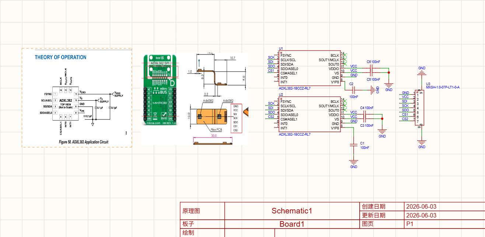
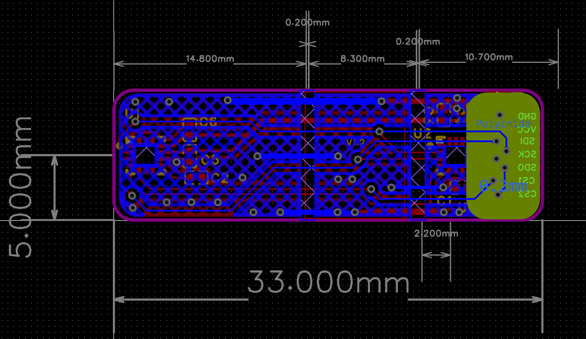
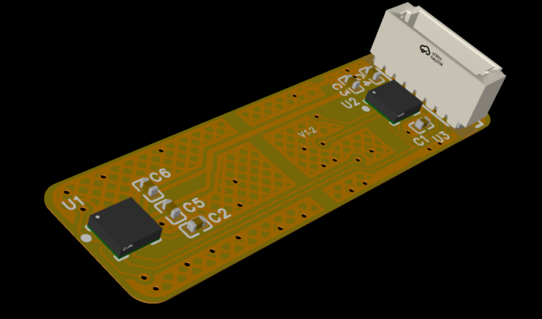

# MEMS FPC / PCB Project

This repository contains PCB design files, schematic, BOM, and 2D/3D mechanical views for an embedded MEMS + FPC-based hardware system.

---

## 📌 Project Overview

This project is based on an ESP32-based embedded system integrating:
- MEMS sensor module
- Flexible PCB (FPC) design
- External PCB manufacturing files (Gerber)
- 2D / 3D mechanical enclosure views

Designed and prepared for production-level validation and assembly.

---

## 📷 Design Preview

### 🔧 Schematic (SCH)

---

### 📐 2D Board View

---

### 🧊 3D View

---

## 📁 Repository Contents

- `SCH.png` → Circuit schematic
- `2D_BottonView.png` → PCB 2D layout view
- `3D_BirdView-A.png` → 3D board visualization
- `3D_BirdView-B.png` → Alternative 3D angle
- `3D_TopView.png` → Top view rendering
- `3D_BottonView.png` → Bottom view rendering
- `Gerber_PCB1_*.zip` → Manufacturing files
- `PickAndPlace_PCB1_*.csv` → SMT assembly file
- `BOM_Board1_*.xlsx` → Bill of materials
- `EasyEDA_MEMS_FPC_V12.epro` → Source design file

---

## ⚙️ Manufacturing

- Gerber files prepared for PCB fabrication
- Pick & Place file included for SMT assembly
- BOM provided for component sourcing

---

## 📌 Notes

This project is intended for:
- Embedded hardware prototyping
- MEMS integration testing
- Flexible PCB evaluation
- Production readiness validation

---

## 🚀 Status

✔ Schematic completed  
✔ PCB layout completed  
✔ 3D mechanical verification completed  
⏳ Prototype fabrication pending / in progress
